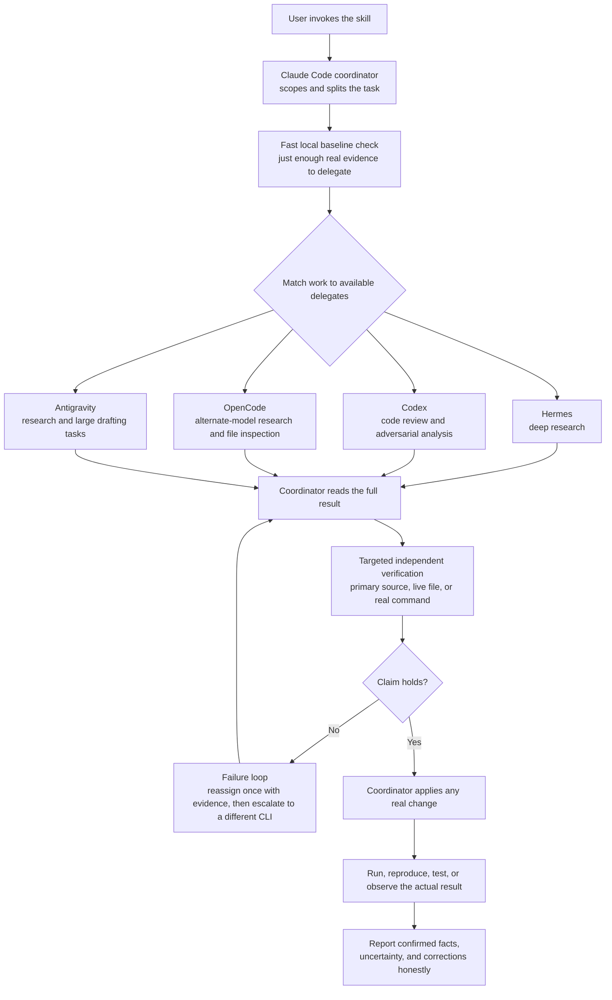

# Multi-AI Framework

**Every AI agent makes claims. Most developers trust them. This framework doesn't.**

Multi-AI Framework turns Claude Code into the accountable coordinator for deep research, review, diagnosis, and build work delegated across the AI CLIs you already use — Codex, OpenCode, Hermes Agent, and Google Antigravity.

[](LICENSE)
[](SKILL.md)
[](https://github.com/shubhsaxena2020/multi-ai-framework/commits/master)

> **A delegate's output is a hypothesis, not a result.**

You're already paying for Claude Code *and* Codex *and* OpenCode *and* whatever else. Most setups let one of them do all the thinking and take the rest on faith. This one doesn't: Claude Code scopes the work, delegates the investigative or generative legwork to whichever CLI fits, independently verifies every consequential claim against a primary source, and remains the only actor that applies changes to your real working environment.

No other public project combines heterogeneous multi-CLI orchestration, mandatory independent verification of what comes back, and a drop-in Claude Code skill form factor — this isn't a crowded space, it's a specific, previously-unaddressed gap.

## Why this exists

This skill addresses two problems discovered across real sessions:

1. **The coordinator should not spend its own budget doing every expensive piece of work.** Deep research, root-cause investigation, adversarial review, and large from-scratch generation can be routed through other CLIs running on separate subscriptions, credits, or local/free models.
2. **Delegation does not create truth.** A confident report can still contain a false schema claim, a plausible but unproved root cause, or a number corrupted before it even reached the delegate. Agreement between two models is not enough either — the deciding evidence must come from the primary source, live system, real file, or an actual command run.

The result is a deliberately centralized operating model: **investigation delegates; mutation and final verification stay with Claude Code.**

## How it works

When you say **"use multi AI framework"** — or ask for equivalent deep/heavy research, review, or build work — Claude Code loads [`SKILL.md`](SKILL.md) and follows the companion specifications relevant to the task.



The flow is intentionally not peer-to-peer. Delegates do not approve one another by majority vote, and they do not receive the current Claude Code conversation automatically. Each call is treated as a cold process with a self-contained prompt. If verification fails, the coordinator loops the work back with the specific failure evidence instead of quietly absorbing the whole investigation and finishing it solo.

## Quick start

```bash
# 1. Install
git clone https://github.com/shubhsaxena2020/multi-ai-framework.git ~/.claude/skills/multi-ai-framework

# 2. Point it at your own CLIs
#    Open TOOLS_AND_MCP.md and swap in your actual delegate commands/paths

# 3. Use it
#    In a Claude Code session, say:
#    "Use multi AI framework to investigate this failing integration,
#     propose a fix, and verify the result against the real code and test output."
```

Phrases such as **"deep work," "heavy work,"** and **"use all AIs"** also match the skill's intended trigger. Claude Code may select it automatically for deep research, review, or build tasks based on the description in [`SKILL.md`](SKILL.md).

## What you should expect when it runs

- **Deep work is the default.** Delegated tasks should perform real research, broad code/system inspection, bug hunting, and meaningful testing where the task calls for them — not return a shallow first pass.
- **All available delegate AIs are in scope.** Work is matched to the tools that fit it. This does not mean racing all four CLIs against the same question without a reconciliation plan.
- **Long-running work is actively monitored.** Background processes receive a real liveness check roughly every two minutes, using process inspection that shows full command lines so a truncated process listing does not create a false negative.
- **Prompts are self-contained and evidence-bearing.** Delegates start cold, so the coordinator includes the actual context, files, logs, constraints, numbered questions, and fact-checking expectation in each prompt.
- **Every material claim faces a quality gate.** Numbers, schemas, review findings, operational costs, and "it works" statements are checked against the kind of evidence that can actually establish them.
- **Only the coordinator mutates the real environment.** A delegate may return research, code, a diff, or commands; Claude Code reviews and applies any change, then independently tests it.
- **Safety authority never moves to a delegate.** Destructive, irreversible, spend-affecting, or downtime-producing actions still require the user's authorization.

See [`REQUIREMENTS.md`](REQUIREMENTS.md) for the complete R1–R9 contract and [`QUALITY_GATES.md`](QUALITY_GATES.md) for the evidence standards.

## Where it fits

Multi-AI Framework is an **operating skill for an existing Claude Code session**, not a general-purpose agent runtime and not another coding model. These projects are adjacent, but they solve different layers of the problem:

| Project | Designed for | How this skill differs |
|---|---|---|
| [LangGraph](https://docs.langchain.com/oss/python/langgraph/overview) | Building long-running, stateful agent applications with graph control, persistence, streaming, and human-in-the-loop execution | No application runtime or graph needs to be built. This is a Markdown operating contract that governs how Claude Code uses existing external CLIs during real work. |
| [CrewAI](https://docs.crewai.com/) | Building Python crews and flows with role-based agents, tasks, process control, state, and deployment tooling | This skill does not create a new crew runtime. It coordinates already-installed command-line agents and centralizes verification and mutation in Claude Code. |
| [AutoGen](https://microsoft.github.io/autogen/) | Building conversational single- and multi-agent applications, teams, handoffs, and event-driven workflows | Delegates here are cold CLI processes, not persistent conversational peers. They do not share context or hand work directly to one another. |
| [Aider](https://aider.chat/docs/) | AI pair programming and repository editing from the terminal | Aider is an interactive coding client; this skill is a delegation and evidence-verification policy. A coding CLI can be added as a delegate, but it does not replace the coordinator's verification role. |

Use this skill when you already work in Claude Code and want a documented, verification-first way to spread deep work across separate AI CLIs. Use an application framework when you need to build, persist, deploy, and observe a multi-agent product of your own.

## The specification

Each file has one job:

- [`SKILL.md`](SKILL.md) — entry point, trigger description, standing defaults, and the one-sentence operating rule
- [`SKILL_BRIEF.md`](SKILL_BRIEF.md) — compact mental model, rationale, and non-goals
- [`REQUIREMENTS.md`](REQUIREMENTS.md) — the R1–R9 obligations that define what "using the framework" means
- [`BEHAVIOR_SPEC.md`](BEHAVIOR_SPEC.md) — the coordinator's "boss, not worker" posture in concrete behavioral terms
- [`WORKFLOW.md`](WORKFLOW.md) — the end-to-end scope, dispatch, verification, mutation, retry, and reporting sequence
- [`TOOLS_AND_MCP.md`](TOOLS_AND_MCP.md) — reference CLI commands, Windows paths, resolution order, and known quirks
- [`PROMPT_ARCHITECTURE.md`](PROMPT_ARCHITECTURE.md) — how to create self-contained, specific, fact-checkable delegation prompts
- [`CONTEXT_MODEL.md`](CONTEXT_MODEL.md) — what state crosses a delegated call and what must be supplied explicitly
- [`QUALITY_GATES.md`](QUALITY_GATES.md) — the checks a result must pass before it is acted on or reported as fact
- [`FAILURE_AND_RECOVERY.md`](FAILURE_AND_RECOVERY.md) — observed hangs, PATH gaps, prompt corruption, false claims, and recovery procedures
- [`TEST_SUITE.md`](TEST_SUITE.md) — retrospective incident validation plus the per-invocation self-check
- [`EVOLUTION_PLAN.md`](EVOLUTION_PLAN.md) — deliberate non-goals, evidence behind current decisions, and triggers for revisiting them

## Honest boundaries

This repository is a behavior specification, not an executable orchestration engine:

- Its test suite is retrospective and advisory; it does not mechanically enforce every requirement.
- Its concrete tool paths and failure history come from one Windows environment and will drift as CLIs change.
- Same-question fan-out with consensus voting is deliberately out of scope.
- Automated fact-checking, formal delegate trust scores, and persistent cross-session reliability tracking are not implemented.
- A delegate recommendation is never proof and never user authorization.

Those constraints are documented because the goal is not to look autonomous. The goal is to make delegated work **more useful without making it less accountable**.

## Adapting and evolving it

Treat [`REQUIREMENTS.md`](REQUIREMENTS.md), [`BEHAVIOR_SPEC.md`](BEHAVIOR_SPEC.md), [`WORKFLOW.md`](WORKFLOW.md), and [`QUALITY_GATES.md`](QUALITY_GATES.md) as the portable core. Treat [`TOOLS_AND_MCP.md`](TOOLS_AND_MCP.md) and the incident catalog in [`FAILURE_AND_RECOVERY.md`](FAILURE_AND_RECOVERY.md) as a worked example to replace and update as your environment changes.

When a new failure mode appears, record the real incident and its verified recovery. When a workaround becomes stale, remove or revise it. The framework is intended to remain a living reflection of observed behavior, not a collection of hypothetical best practices.

## License

MIT — see [`LICENSE`](LICENSE).
